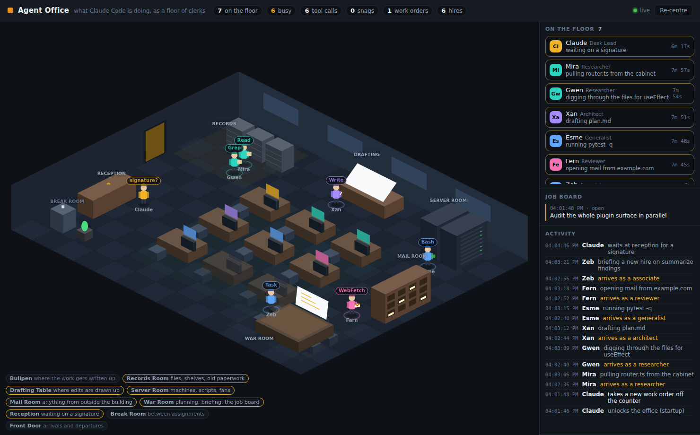

# Agent Office

Watch what Claude Code is doing as a floor of clerks in an office.

> **中文速覽**：這個 plugin 把 Claude Code 正在做的事畫成一間辦公室。安裝後在任何
> session 輸入 `/office` 就會開一個本機網頁（預設 <http://127.0.0.1:4269/>）。介面
> 預設為繁體中文，右上角可切換語言；`/office state` 則直接在終端機列出樓面狀況。
> 所有資料都留在本機，不會外傳。

Every lifecycle event becomes something physical. A `Read` sends someone to the
records room to pull a file out of a cabinet. A `Bash` call puts them in the
server room. A subagent is a new hire who walks in the front door, is shown to a
desk, does their job, hands in a report and clocks out. A permission prompt
leaves the desk lead standing at reception waiting for a signature.



## Install

```
/plugin marketplace add wed1688-afk/openclaw
/plugin install agent-office@openclaw
```

Then, in any session:

```
/office
```

That starts a local server and prints a URL (normally <http://127.0.0.1:4269/>).
The floor fills in as the session works. `/office state` answers in the terminal
instead, `/office stop` closes it, and `/office demo` serves a staged shift so
you can see a busy office without waiting for one.

## Who goes where

| What Claude Code does | Where the clerk goes |
| --- | --- |
| `Read`, `Grep`, `Glob`, `NotebookRead` | 檔案室 / Records Room — pulling files out of cabinets |
| `Edit`, `Write`, `NotebookEdit` | 製圖桌 / Drafting Table — marking up drawings |
| `Bash`, `BashOutput`, `KillShell` | 機房 / Server Room — racks, scripts, blinking lights |
| `WebFetch`, `WebSearch`, MCP tools | 收發室 / Mail Room — anything from outside the building |
| `Task`, `Skill`, `TodoWrite`, `Workflow` | 作戰室 / War Room — briefing, planning, the job board |
| `AskUserQuestion`, permission prompts | 櫃檯 / Reception — waiting on a signature |
| Idle, between assignments | 茶水間 / Break Room — coffee |
| Subagent starts / stops | 大門 / Front Door — arrivals and departures |
| Everything else | 大辦公區 / their own desk in the bullpen |

Tool names stay as Claude Code writes them (`Read`, `Bash`, …) in every
language, so what floats above a clerk's head matches what the session shows.

The right-hand panels carry the same information as text: who is on the floor
and for how long, the job board of recent prompts, and a running activity log.
Drag to pan, scroll to zoom, **Re-centre** to reset.

## Language

The view ships in Traditional Chinese (`zh-Hant`) and English (`en`), and
Chinese is the default. Pick one with the selector in the top right, or:

```
office_server.py serve --lang en          # default for the page
office_server.py state --brief --lang en  # just this one listing
AGENT_OFFICE_LANG=en /office              # for everything
```

`http://127.0.0.1:4269/?lang=en` works too.

Wording is applied when a snapshot is rendered, not when an event is recorded:
the ledger stores *what happened* (`{"verb": "read", "target": "main.py"}`), so
switching language re-reads the whole history in the new one rather than leaving
old events stranded. Chinese sets a space against Latin words and not against
itself, so `從檔案櫃抽出 main.py` and `向新人交代彙整發現` both come out right.

To add a language, add an entry to `LOCALES` in `scripts/office_text.py` and one
to `TEXT` in `web/office.js`; the tests fail if a phrase the code uses is missing
from any language.

## How it works

```
Claude Code hooks ──> scripts/office_recorder.py ──> ~/.claude/agent-office/events/<day>.jsonl
                                                                  │
                                            scripts/office_server.py tails the ledger
                                                                  │
                                            /api/stream (SSE) ──> web/office.js draws the floor
```

- **`hooks/hooks.json`** subscribes to thirteen events, from `SessionStart` to
  `SubagentStop`. Every hook is `async`, so the recorder never sits in front of a
  tool call, and it returns nothing Claude Code will read as a decision.
- **`scripts/office_recorder.py`** turns a hook payload into one short JSON line
  and appends it. It swallows its own errors and always exits 0 — a broken
  visualizer must not be able to break a coding session.
- **`scripts/office_state.py`** is the whole model: it maps tools to rooms and
  folds the event stream into a floor plan. No I/O, no dependencies, and it is
  what the tests exercise.
- **`scripts/office_text.py`** holds every phrase, one table per language. The
  reducer stores keys; this turns them into sentences at render time.
- **`scripts/office_server.py`** tails the ledger incrementally (it remembers a
  byte offset per file and ignores a half-written trailing line) and pushes
  snapshots over server-sent events.
- **`web/office.js`** draws the isometric floor on a canvas, walks each clerk to
  whichever station the snapshot puts them at, and depth-sorts furniture and
  people so they occlude each other correctly.

## What leaves your machine

Nothing. The server binds `127.0.0.1`, serves only its own `web/` directory, and
reads only the local ledger.

What gets stored is deliberately thin: an event name, a session id, a tool name,
and what was done to what (`"verb": "read", "target": "main.py"`). File
contents, tool output and full prompts are never written — prompts are clipped
to 180 characters, and anything shaped like a credential (`token=`, `Bearer …`,
`ghp_…`, long hex strings) is replaced with `[redacted]` before it is stored.
Ledgers older than seven days are deleted at the next session start.

If you would rather it recorded nothing at all, disable the plugin — that
removes the hooks with it.

## Configuration

| Variable | Default | Meaning |
| --- | --- | --- |
| `AGENT_OFFICE_HOME` | `~/.claude/agent-office` | Where the ledger lives |
| `AGENT_OFFICE_PORT` | `4269` | Preferred port; the server tries the next 20 if it is taken |
| `AGENT_OFFICE_VERBOSE` | unset | Log HTTP requests to stderr |
| `AGENT_OFFICE_LANG` | `zh-Hant` | Language for the view (`zh-Hant`, `en`) |

`office_server.py serve --days 2` replays more than the current day.

## Development

```
python3 -m unittest discover -s tests          # from the repository root
python3 plugins/agent-office/scripts/office_server.py demo --open
```

The tests cover normalization and redaction, the reducer's handling of every
event, both languages (including that no phrase the code uses is missing from a
language, and that a pre-v2 ledger still reads), the ledger's append/tail
behaviour (including corrupt and half-written lines), and the manifests. `office_server.py state --brief` prints the floor as
text, which is the quickest way to check what the hooks are recording.

The recorder and the server have to agree on that directory, and they run in
very different processes: the recorder is a hook, which Claude Code hands
`CLAUDE_PLUGIN_DATA`, while the server is started from an ordinary shell, which
gets no such variable. So the location is deliberately computed from `$HOME`
alone — keying it off the plugin data directory would have the hooks writing
where the office never looks, and the floor would stay empty forever.

## Limits

- Hooks fire in the session where the plugin is enabled, so the office shows
  that session's work, not every Claude Code session on the machine.
- Subagents appear when they start and stop; their individual tool calls only
  show up separately when the hook payload carries an `agent_id`.
- The floor plan holds twelve desks. Past that, clerks share.
